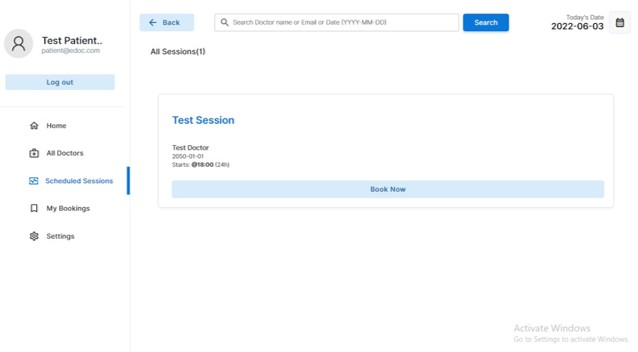

# 🏥 Hospital Management System (eDoc Doctor Appointment System)

A web-based Hospital Management System designed to simplify doctor appointment scheduling and patient management.

The platform supports multiple user roles including **Patients, Doctors, and Administrators**, allowing appointment booking, doctor scheduling, patient records management, and hospital workflow optimization.

---

## ✨ Features

### 👤 Patient Module
- User Registration & Login
- Search available doctors
- View scheduled sessions
- Book appointments
- Track booking history
- Manage account settings

### 👨‍⚕️ Doctor Module
- Doctor authentication
- Dashboard overview
- View appointments
- Manage sessions
- Access patient details
- Account management

### 🛠 Admin Module
- Manage doctors
- Manage patients
- Appointment administration
- Schedule management
- Dashboard analytics

---

## 🧰 Tech Stack

- PHP
- HTML5
- CSS3
- MySQL
- SQL Database
- JavaScript

---

## 📂 Project Structure

```plaintext
Hospital-Management-System
│
├── README.md
├── LICENSE
├── SECURITY.md
├── SQL_Database_edoc.sql
├── connection.php
├── login.php
├── logout.php
├── signup.php
├── create-account.php
├── index.html
│
├── css/
├── assets/
│   └── screenshots/
```

---

## ⚙️ Installation

### Clone Repository

```bash
git clone <repo-link>
```

### Import Database

Import:

```plaintext
SQL_Database_edoc.sql
```

into MySQL.

### Configure Database

Edit:

```plaintext
connection.php
```

Update:

```php
host
username
password
database_name
```

### Run Project

Start:

```plaintext
localhost/Hospital-Management-System
```

---

# 📸 Screenshots

## Landing Page


---

## Login


---

## Patient Dashboard


---

## Appointment Booking


---

## Booking History



---

## Doctor Dashboard


---

## Doctor Settings


---

## Admin Dashboard


---

## Doctor Management


---

## Future Improvements

- Email Notifications
- Online Consultation
- Payment Integration
- Medical Reports Upload
- AI-based Appointment Recommendation

---

## Author

**Husna Juman**
